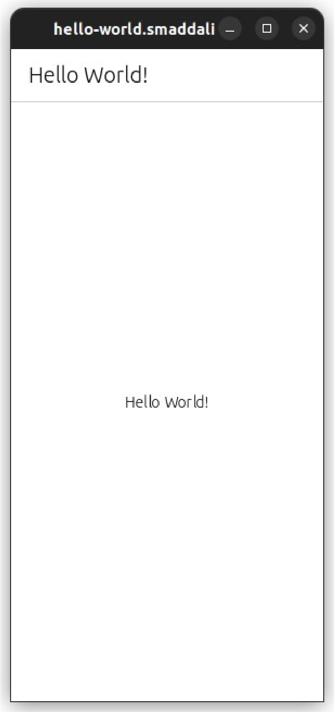

# `ubuntu-touch-apps`
A set of simple, demonstrative apps to leverage the sensors and instruments on Ubuntu touch phones. 

## Screenshots

    <table>
        <tr>
            <td></td>
        </tr>
    </table>

